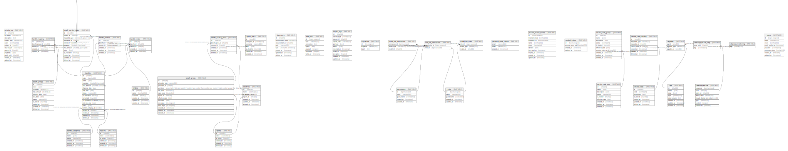

# phoenix_company_api_development

## Tables

| Name | Columns | Comment | Type |
| ---- | ------- | ------- | ---- |
| [activity_log](activity_log.md) | 12 |  | BASE TABLE |
| [benefit_categories](benefit_categories.md) | 6 |  | BASE TABLE |
| [benefit_country_price](benefit_country_price.md) | 6 |  | BASE TABLE |
| [benefit_groups](benefit_groups.md) | 11 |  | BASE TABLE |
| [benefit_mapping](benefit_mapping.md) | 5 |  | BASE TABLE |
| [benefit_prices](benefit_prices.md) | 14 |  | BASE TABLE |
| [benefit_service_codes](benefit_service_codes.md) | 12 |  | BASE TABLE |
| [benefit_vendor](benefit_vendor.md) | 5 |  | BASE TABLE |
| [benefit_vendors](benefit_vendors.md) | 6 |  | BASE TABLE |
| [benefits](benefits.md) | 18 |  | BASE TABLE |
| [cognito_users](cognito_users.md) | 7 |  | BASE TABLE |
| [countries](countries.md) | 7 |  | BASE TABLE |
| [documents](documents.md) | 8 |  | BASE TABLE |
| [failed_jobs](failed_jobs.md) | 7 |  | BASE TABLE |
| [import_logs](import_logs.md) | 11 |  | BASE TABLE |
| [insurers](insurers.md) | 6 |  | BASE TABLE |
| [migrations](migrations.md) | 3 |  | BASE TABLE |
| [model_has_permissions](model_has_permissions.md) | 3 |  | BASE TABLE |
| [model_has_roles](model_has_roles.md) | 3 |  | BASE TABLE |
| [password_reset_tokens](password_reset_tokens.md) | 3 |  | BASE TABLE |
| [permissions](permissions.md) | 5 |  | BASE TABLE |
| [personal_access_tokens](personal_access_tokens.md) | 10 |  | BASE TABLE |
| [regions](regions.md) | 6 |  | BASE TABLE |
| [revoked_tokens](revoked_tokens.md) | 4 |  | BASE TABLE |
| [role_has_permissions](role_has_permissions.md) | 2 |  | BASE TABLE |
| [roles](roles.md) | 5 |  | BASE TABLE |
| [service_code_groups](service_code_groups.md) | 10 |  | BASE TABLE |
| [service_code_mapping](service_code_mapping.md) | 7 |  | BASE TABLE |
| [service_code_sets](service_code_sets.md) | 9 |  | BASE TABLE |
| [service_codes](service_codes.md) | 7 |  | BASE TABLE |
| [taggables](taggables.md) | 3 |  | BASE TABLE |
| [tags](tags.md) | 8 |  | BASE TABLE |
| [telescope_entries](telescope_entries.md) | 8 |  | BASE TABLE |
| [telescope_entries_tags](telescope_entries_tags.md) | 2 |  | BASE TABLE |
| [telescope_monitoring](telescope_monitoring.md) | 1 |  | BASE TABLE |
| [users](users.md) | 8 |  | BASE TABLE |
| [vendors](vendors.md) | 6 |  | BASE TABLE |

## Relations

---

> Generated by [tbls](https://github.com/k1LoW/tbls)
