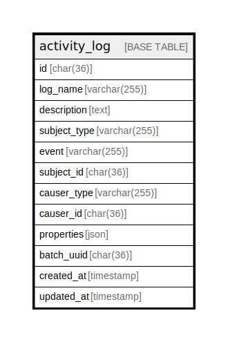

# activity_log

## Description

<details>
<summary><strong>Table Definition</strong></summary>

```sql
CREATE TABLE `activity_log` (
  `id` char(36) COLLATE utf8mb4_unicode_ci NOT NULL,
  `log_name` varchar(255) COLLATE utf8mb4_unicode_ci DEFAULT NULL,
  `description` text COLLATE utf8mb4_unicode_ci NOT NULL,
  `subject_type` varchar(255) COLLATE utf8mb4_unicode_ci DEFAULT NULL,
  `event` varchar(255) COLLATE utf8mb4_unicode_ci DEFAULT NULL,
  `subject_id` char(36) COLLATE utf8mb4_unicode_ci DEFAULT NULL,
  `causer_type` varchar(255) COLLATE utf8mb4_unicode_ci DEFAULT NULL,
  `causer_id` char(36) COLLATE utf8mb4_unicode_ci DEFAULT NULL,
  `properties` json DEFAULT NULL,
  `batch_uuid` char(36) COLLATE utf8mb4_unicode_ci DEFAULT NULL,
  `created_at` timestamp NULL DEFAULT NULL,
  `updated_at` timestamp NULL DEFAULT NULL,
  PRIMARY KEY (`id`),
  KEY `subject` (`subject_type`,`subject_id`),
  KEY `causer` (`causer_type`,`causer_id`),
  KEY `activity_log_log_name_index` (`log_name`)
) ENGINE=InnoDB DEFAULT CHARSET=utf8mb4 COLLATE=utf8mb4_unicode_ci
```

</details>

## Columns

| Name | Type | Default | Nullable | Children | Parents | Comment |
| ---- | ---- | ------- | -------- | -------- | ------- | ------- |
| id | char(36) |  | false |  |  |  |
| log_name | varchar(255) |  | true |  |  |  |
| description | text |  | false |  |  |  |
| subject_type | varchar(255) |  | true |  |  |  |
| event | varchar(255) |  | true |  |  |  |
| subject_id | char(36) |  | true |  |  |  |
| causer_type | varchar(255) |  | true |  |  |  |
| causer_id | char(36) |  | true |  |  |  |
| properties | json |  | true |  |  |  |
| batch_uuid | char(36) |  | true |  |  |  |
| created_at | timestamp |  | true |  |  |  |
| updated_at | timestamp |  | true |  |  |  |

## Constraints

| Name | Type | Definition |
| ---- | ---- | ---------- |
| PRIMARY | PRIMARY KEY | PRIMARY KEY (id) |

## Indexes

| Name | Definition |
| ---- | ---------- |
| activity_log_log_name_index | KEY activity_log_log_name_index (log_name) USING BTREE |
| causer | KEY causer (causer_type, causer_id) USING BTREE |
| subject | KEY subject (subject_type, subject_id) USING BTREE |
| PRIMARY | PRIMARY KEY (id) USING BTREE |

## Relations



---

> Generated by [tbls](https://github.com/k1LoW/tbls)
