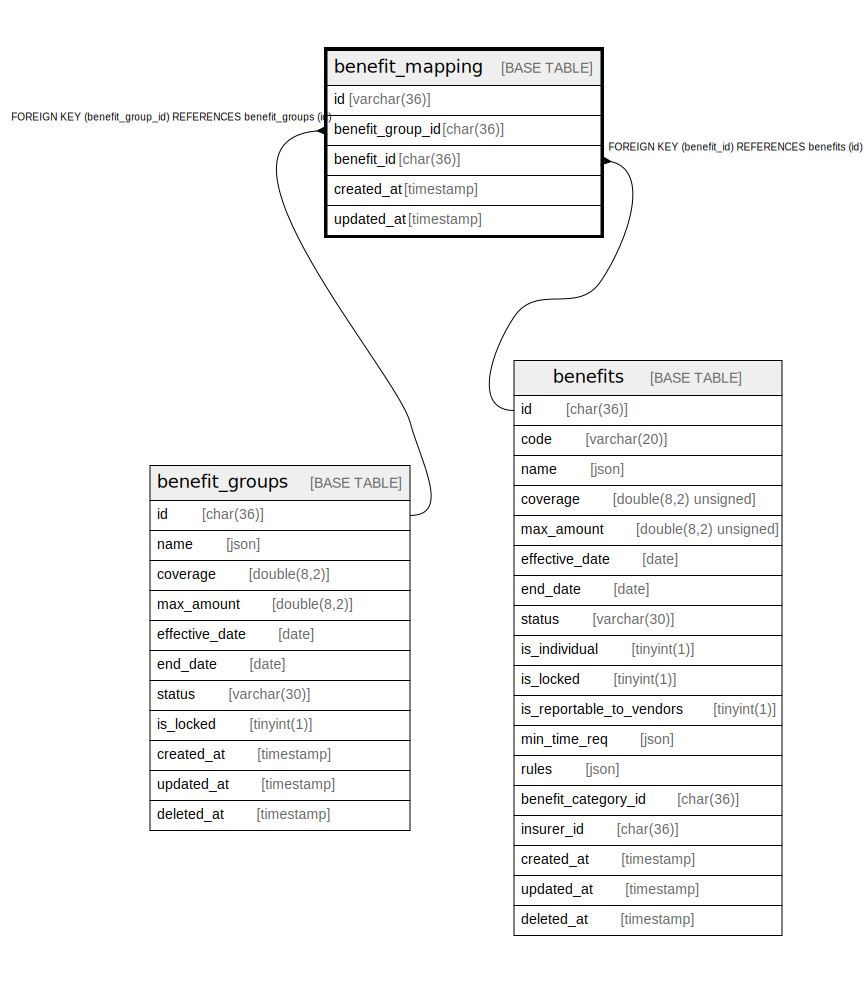

# benefit_mapping

## Description

<details>
<summary><strong>Table Definition</strong></summary>

```sql
CREATE TABLE `benefit_mapping` (
  `id` varchar(36) COLLATE utf8mb4_unicode_ci NOT NULL,
  `benefit_group_id` char(36) COLLATE utf8mb4_unicode_ci NOT NULL,
  `benefit_id` char(36) COLLATE utf8mb4_unicode_ci NOT NULL,
  `created_at` timestamp NULL DEFAULT NULL,
  `updated_at` timestamp NULL DEFAULT NULL,
  PRIMARY KEY (`id`),
  KEY `benefit_mapping_benefit_id_foreign` (`benefit_id`),
  KEY `benefit_group` (`benefit_group_id`,`benefit_id`),
  CONSTRAINT `benefit_mapping_benefit_group_id_foreign` FOREIGN KEY (`benefit_group_id`) REFERENCES `benefit_groups` (`id`) ON DELETE CASCADE,
  CONSTRAINT `benefit_mapping_benefit_id_foreign` FOREIGN KEY (`benefit_id`) REFERENCES `benefits` (`id`) ON DELETE CASCADE
) ENGINE=InnoDB DEFAULT CHARSET=utf8mb4 COLLATE=utf8mb4_unicode_ci
```

</details>

## Columns

| Name | Type | Default | Nullable | Children | Parents | Comment |
| ---- | ---- | ------- | -------- | -------- | ------- | ------- |
| id | varchar(36) |  | false |  |  |  |
| benefit_group_id | char(36) |  | false |  | [benefit_groups](benefit_groups.md) |  |
| benefit_id | char(36) |  | false |  | [benefits](benefits.md) |  |
| created_at | timestamp |  | true |  |  |  |
| updated_at | timestamp |  | true |  |  |  |

## Constraints

| Name | Type | Definition |
| ---- | ---- | ---------- |
| benefit_mapping_benefit_group_id_foreign | FOREIGN KEY | FOREIGN KEY (benefit_group_id) REFERENCES benefit_groups (id) |
| benefit_mapping_benefit_id_foreign | FOREIGN KEY | FOREIGN KEY (benefit_id) REFERENCES benefits (id) |
| PRIMARY | PRIMARY KEY | PRIMARY KEY (id) |

## Indexes

| Name | Definition |
| ---- | ---------- |
| benefit_group | KEY benefit_group (benefit_group_id, benefit_id) USING BTREE |
| benefit_mapping_benefit_id_foreign | KEY benefit_mapping_benefit_id_foreign (benefit_id) USING BTREE |
| PRIMARY | PRIMARY KEY (id) USING BTREE |

## Relations



---

> Generated by [tbls](https://github.com/k1LoW/tbls)
