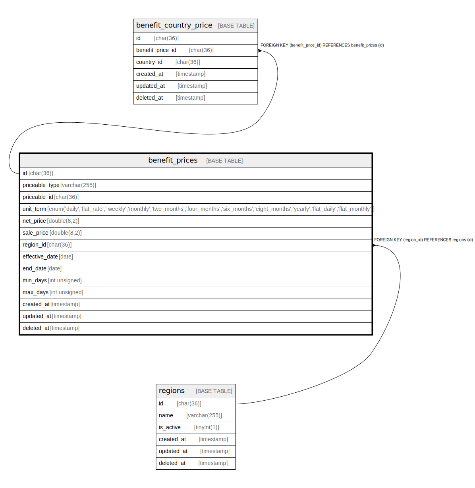

# benefit_prices

## Description

<details>
<summary><strong>Table Definition</strong></summary>

```sql
CREATE TABLE `benefit_prices` (
  `id` char(36) COLLATE utf8mb4_unicode_ci NOT NULL,
  `priceable_type` varchar(255) COLLATE utf8mb4_unicode_ci NOT NULL,
  `priceable_id` char(36) COLLATE utf8mb4_unicode_ci NOT NULL,
  `unit_term` enum('daily','flat_rate',' weekly','monthly','two_months','four_months','six_months','eight_months','yearly','flat_daily','flat_monthly') COLLATE utf8mb4_unicode_ci NOT NULL,
  `net_price` double(8,2) NOT NULL,
  `sale_price` double(8,2) NOT NULL,
  `region_id` char(36) COLLATE utf8mb4_unicode_ci NOT NULL,
  `effective_date` date NOT NULL,
  `end_date` date DEFAULT NULL,
  `min_days` int unsigned DEFAULT NULL,
  `max_days` int unsigned DEFAULT NULL,
  `created_at` timestamp NULL DEFAULT NULL,
  `updated_at` timestamp NULL DEFAULT NULL,
  `deleted_at` timestamp NULL DEFAULT NULL,
  PRIMARY KEY (`id`),
  KEY `benefit_prices_priceable_type_priceable_id_index` (`priceable_type`,`priceable_id`),
  KEY `benefit_prices_region_id_foreign` (`region_id`),
  CONSTRAINT `benefit_prices_region_id_foreign` FOREIGN KEY (`region_id`) REFERENCES `regions` (`id`) ON DELETE CASCADE
) ENGINE=InnoDB DEFAULT CHARSET=utf8mb4 COLLATE=utf8mb4_unicode_ci
```

</details>

## Columns

| Name | Type | Default | Nullable | Children | Parents | Comment |
| ---- | ---- | ------- | -------- | -------- | ------- | ------- |
| id | char(36) |  | false | [benefit_country_price](benefit_country_price.md) |  |  |
| priceable_type | varchar(255) |  | false |  |  |  |
| priceable_id | char(36) |  | false |  |  |  |
| unit_term | enum('daily','flat_rate',' weekly','monthly','two_months','four_months','six_months','eight_months','yearly','flat_daily','flat_monthly') |  | false |  |  |  |
| net_price | double(8,2) |  | false |  |  |  |
| sale_price | double(8,2) |  | false |  |  |  |
| region_id | char(36) |  | false |  | [regions](regions.md) |  |
| effective_date | date |  | false |  |  |  |
| end_date | date |  | true |  |  |  |
| min_days | int unsigned |  | true |  |  |  |
| max_days | int unsigned |  | true |  |  |  |
| created_at | timestamp |  | true |  |  |  |
| updated_at | timestamp |  | true |  |  |  |
| deleted_at | timestamp |  | true |  |  |  |

## Constraints

| Name | Type | Definition |
| ---- | ---- | ---------- |
| benefit_prices_region_id_foreign | FOREIGN KEY | FOREIGN KEY (region_id) REFERENCES regions (id) |
| PRIMARY | PRIMARY KEY | PRIMARY KEY (id) |

## Indexes

| Name | Definition |
| ---- | ---------- |
| benefit_prices_priceable_type_priceable_id_index | KEY benefit_prices_priceable_type_priceable_id_index (priceable_type, priceable_id) USING BTREE |
| benefit_prices_region_id_foreign | KEY benefit_prices_region_id_foreign (region_id) USING BTREE |
| PRIMARY | PRIMARY KEY (id) USING BTREE |

## Relations



---

> Generated by [tbls](https://github.com/k1LoW/tbls)
