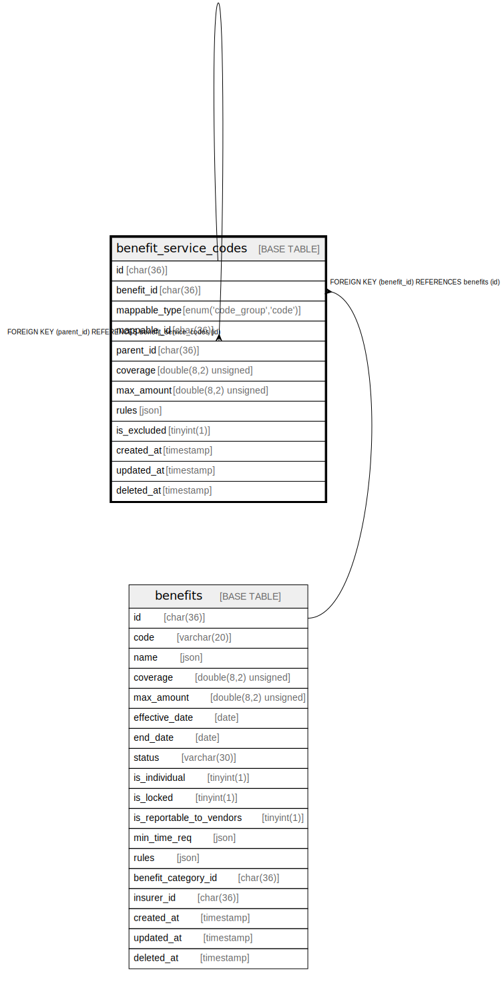

# benefit_service_codes

## Description

<details>
<summary><strong>Table Definition</strong></summary>

```sql
CREATE TABLE `benefit_service_codes` (
  `id` char(36) COLLATE utf8mb4_unicode_ci NOT NULL,
  `benefit_id` char(36) COLLATE utf8mb4_unicode_ci NOT NULL,
  `mappable_type` enum('code_group','code') COLLATE utf8mb4_unicode_ci NOT NULL,
  `mappable_id` char(36) COLLATE utf8mb4_unicode_ci DEFAULT NULL,
  `parent_id` char(36) COLLATE utf8mb4_unicode_ci DEFAULT NULL,
  `coverage` double(8,2) unsigned DEFAULT NULL,
  `max_amount` double(8,2) unsigned DEFAULT NULL,
  `rules` json DEFAULT NULL,
  `is_excluded` tinyint(1) NOT NULL DEFAULT '0',
  `created_at` timestamp NULL DEFAULT NULL,
  `updated_at` timestamp NULL DEFAULT NULL,
  `deleted_at` timestamp NULL DEFAULT NULL,
  PRIMARY KEY (`id`),
  KEY `benefit_service_codes_parent_id_foreign` (`parent_id`),
  KEY `mappable_index` (`mappable_id`,`mappable_type`),
  KEY `benefit_service_code_group` (`benefit_id`,`mappable_type`,`mappable_id`),
  CONSTRAINT `benefit_service_codes_benefit_id_foreign` FOREIGN KEY (`benefit_id`) REFERENCES `benefits` (`id`) ON DELETE CASCADE,
  CONSTRAINT `benefit_service_codes_parent_id_foreign` FOREIGN KEY (`parent_id`) REFERENCES `benefit_service_codes` (`id`) ON DELETE CASCADE
) ENGINE=InnoDB DEFAULT CHARSET=utf8mb4 COLLATE=utf8mb4_unicode_ci
```

</details>

## Columns

| Name | Type | Default | Nullable | Children | Parents | Comment |
| ---- | ---- | ------- | -------- | -------- | ------- | ------- |
| id | char(36) |  | false | [benefit_service_codes](benefit_service_codes.md) |  |  |
| benefit_id | char(36) |  | false |  | [benefits](benefits.md) |  |
| mappable_type | enum('code_group','code') |  | false |  |  |  |
| mappable_id | char(36) |  | true |  |  |  |
| parent_id | char(36) |  | true |  | [benefit_service_codes](benefit_service_codes.md) |  |
| coverage | double(8,2) unsigned |  | true |  |  |  |
| max_amount | double(8,2) unsigned |  | true |  |  |  |
| rules | json |  | true |  |  |  |
| is_excluded | tinyint(1) | 0 | false |  |  |  |
| created_at | timestamp |  | true |  |  |  |
| updated_at | timestamp |  | true |  |  |  |
| deleted_at | timestamp |  | true |  |  |  |

## Constraints

| Name | Type | Definition |
| ---- | ---- | ---------- |
| benefit_service_codes_benefit_id_foreign | FOREIGN KEY | FOREIGN KEY (benefit_id) REFERENCES benefits (id) |
| benefit_service_codes_parent_id_foreign | FOREIGN KEY | FOREIGN KEY (parent_id) REFERENCES benefit_service_codes (id) |
| PRIMARY | PRIMARY KEY | PRIMARY KEY (id) |

## Indexes

| Name | Definition |
| ---- | ---------- |
| benefit_service_code_group | KEY benefit_service_code_group (benefit_id, mappable_type, mappable_id) USING BTREE |
| benefit_service_codes_parent_id_foreign | KEY benefit_service_codes_parent_id_foreign (parent_id) USING BTREE |
| mappable_index | KEY mappable_index (mappable_id, mappable_type) USING BTREE |
| PRIMARY | PRIMARY KEY (id) USING BTREE |

## Relations



---

> Generated by [tbls](https://github.com/k1LoW/tbls)
