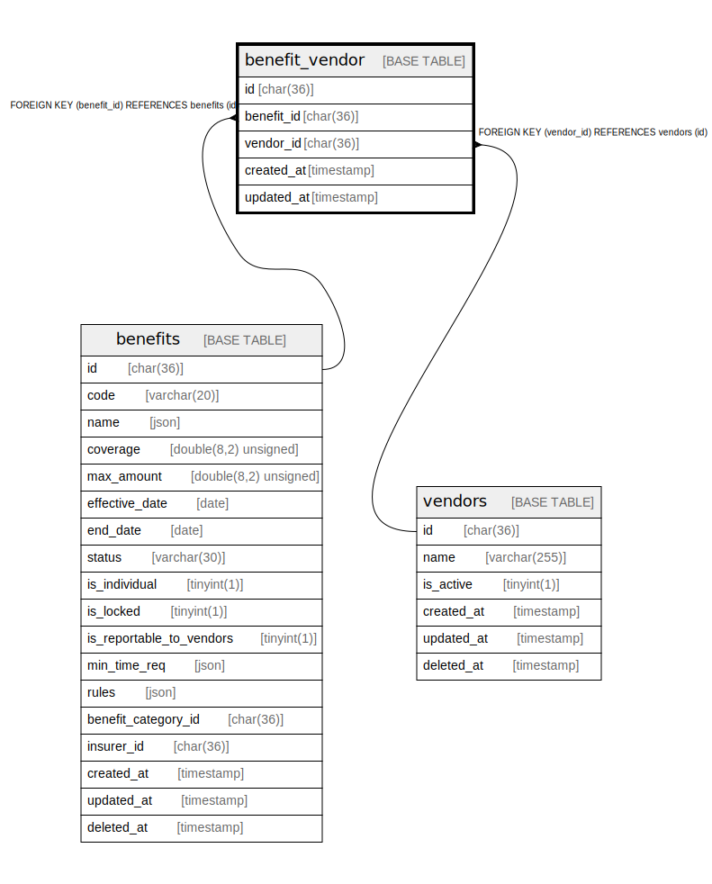

# benefit_vendor

## Description

<details>
<summary><strong>Table Definition</strong></summary>

```sql
CREATE TABLE `benefit_vendor` (
  `id` char(36) COLLATE utf8mb4_unicode_ci NOT NULL,
  `benefit_id` char(36) COLLATE utf8mb4_unicode_ci NOT NULL,
  `vendor_id` char(36) COLLATE utf8mb4_unicode_ci NOT NULL,
  `created_at` timestamp NULL DEFAULT NULL,
  `updated_at` timestamp NULL DEFAULT NULL,
  PRIMARY KEY (`id`),
  KEY `benefit_vendor_vendor_id_foreign` (`vendor_id`),
  KEY `benefit_vendor_index` (`benefit_id`,`vendor_id`),
  CONSTRAINT `benefit_vendor_benefit_id_foreign` FOREIGN KEY (`benefit_id`) REFERENCES `benefits` (`id`) ON DELETE CASCADE,
  CONSTRAINT `benefit_vendor_vendor_id_foreign` FOREIGN KEY (`vendor_id`) REFERENCES `vendors` (`id`) ON DELETE CASCADE
) ENGINE=InnoDB DEFAULT CHARSET=utf8mb4 COLLATE=utf8mb4_unicode_ci
```

</details>

## Columns

| Name | Type | Default | Nullable | Children | Parents | Comment |
| ---- | ---- | ------- | -------- | -------- | ------- | ------- |
| id | char(36) |  | false |  |  |  |
| benefit_id | char(36) |  | false |  | [benefits](benefits.md) |  |
| vendor_id | char(36) |  | false |  | [vendors](vendors.md) |  |
| created_at | timestamp |  | true |  |  |  |
| updated_at | timestamp |  | true |  |  |  |

## Constraints

| Name | Type | Definition |
| ---- | ---- | ---------- |
| benefit_vendor_benefit_id_foreign | FOREIGN KEY | FOREIGN KEY (benefit_id) REFERENCES benefits (id) |
| benefit_vendor_vendor_id_foreign | FOREIGN KEY | FOREIGN KEY (vendor_id) REFERENCES vendors (id) |
| PRIMARY | PRIMARY KEY | PRIMARY KEY (id) |

## Indexes

| Name | Definition |
| ---- | ---------- |
| benefit_vendor_index | KEY benefit_vendor_index (benefit_id, vendor_id) USING BTREE |
| benefit_vendor_vendor_id_foreign | KEY benefit_vendor_vendor_id_foreign (vendor_id) USING BTREE |
| PRIMARY | PRIMARY KEY (id) USING BTREE |

## Relations



---

> Generated by [tbls](https://github.com/k1LoW/tbls)
