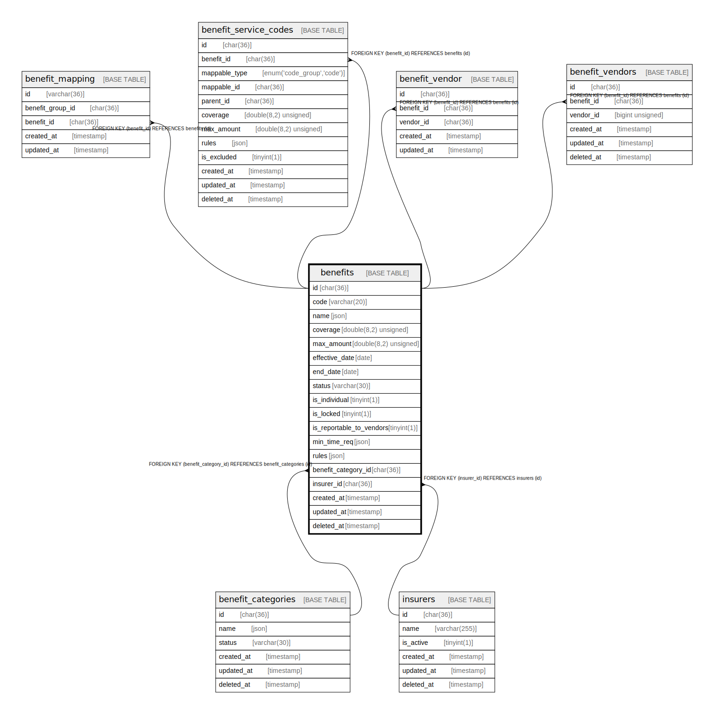

# benefits

## Description

<details>
<summary><strong>Table Definition</strong></summary>

```sql
CREATE TABLE `benefits` (
  `id` char(36) COLLATE utf8mb4_unicode_ci NOT NULL,
  `code` varchar(20) COLLATE utf8mb4_unicode_ci NOT NULL,
  `name` json NOT NULL,
  `coverage` double(8,2) unsigned DEFAULT NULL,
  `max_amount` double(8,2) unsigned DEFAULT NULL,
  `effective_date` date DEFAULT NULL,
  `end_date` date DEFAULT NULL,
  `status` varchar(30) COLLATE utf8mb4_unicode_ci NOT NULL DEFAULT 'inactive',
  `is_individual` tinyint(1) NOT NULL DEFAULT '0',
  `is_locked` tinyint(1) NOT NULL DEFAULT '0',
  `is_reportable_to_vendors` tinyint(1) NOT NULL DEFAULT '0',
  `min_time_req` json DEFAULT NULL,
  `rules` json DEFAULT NULL,
  `benefit_category_id` char(36) COLLATE utf8mb4_unicode_ci NOT NULL,
  `insurer_id` char(36) COLLATE utf8mb4_unicode_ci DEFAULT NULL,
  `created_at` timestamp NULL DEFAULT NULL,
  `updated_at` timestamp NULL DEFAULT NULL,
  `deleted_at` timestamp NULL DEFAULT NULL,
  PRIMARY KEY (`id`),
  KEY `benefits_benefit_category_id_foreign` (`benefit_category_id`),
  KEY `benefits_insurer_id_foreign` (`insurer_id`),
  KEY `benefits_code_index` (`code`),
  CONSTRAINT `benefits_benefit_category_id_foreign` FOREIGN KEY (`benefit_category_id`) REFERENCES `benefit_categories` (`id`) ON DELETE CASCADE,
  CONSTRAINT `benefits_insurer_id_foreign` FOREIGN KEY (`insurer_id`) REFERENCES `insurers` (`id`) ON DELETE SET NULL
) ENGINE=InnoDB DEFAULT CHARSET=utf8mb4 COLLATE=utf8mb4_unicode_ci
```

</details>

## Columns

| Name | Type | Default | Nullable | Children | Parents | Comment |
| ---- | ---- | ------- | -------- | -------- | ------- | ------- |
| id | char(36) |  | false | [benefit_mapping](benefit_mapping.md) [benefit_service_codes](benefit_service_codes.md) [benefit_vendor](benefit_vendor.md) [benefit_vendors](benefit_vendors.md) |  |  |
| code | varchar(20) |  | false |  |  |  |
| name | json |  | false |  |  |  |
| coverage | double(8,2) unsigned |  | true |  |  |  |
| max_amount | double(8,2) unsigned |  | true |  |  |  |
| effective_date | date |  | true |  |  |  |
| end_date | date |  | true |  |  |  |
| status | varchar(30) | inactive | false |  |  |  |
| is_individual | tinyint(1) | 0 | false |  |  |  |
| is_locked | tinyint(1) | 0 | false |  |  |  |
| is_reportable_to_vendors | tinyint(1) | 0 | false |  |  |  |
| min_time_req | json |  | true |  |  |  |
| rules | json |  | true |  |  |  |
| benefit_category_id | char(36) |  | false |  | [benefit_categories](benefit_categories.md) |  |
| insurer_id | char(36) |  | true |  | [insurers](insurers.md) |  |
| created_at | timestamp |  | true |  |  |  |
| updated_at | timestamp |  | true |  |  |  |
| deleted_at | timestamp |  | true |  |  |  |

## Constraints

| Name | Type | Definition |
| ---- | ---- | ---------- |
| benefits_benefit_category_id_foreign | FOREIGN KEY | FOREIGN KEY (benefit_category_id) REFERENCES benefit_categories (id) |
| benefits_insurer_id_foreign | FOREIGN KEY | FOREIGN KEY (insurer_id) REFERENCES insurers (id) |
| PRIMARY | PRIMARY KEY | PRIMARY KEY (id) |

## Indexes

| Name | Definition |
| ---- | ---------- |
| benefits_benefit_category_id_foreign | KEY benefits_benefit_category_id_foreign (benefit_category_id) USING BTREE |
| benefits_code_index | KEY benefits_code_index (code) USING BTREE |
| benefits_insurer_id_foreign | KEY benefits_insurer_id_foreign (insurer_id) USING BTREE |
| PRIMARY | PRIMARY KEY (id) USING BTREE |

## Relations



---

> Generated by [tbls](https://github.com/k1LoW/tbls)
