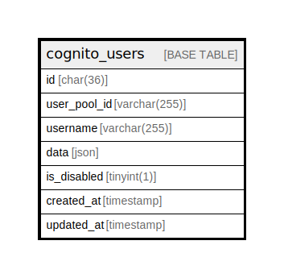

# cognito_users

## Description

<details>
<summary><strong>Table Definition</strong></summary>

```sql
CREATE TABLE `cognito_users` (
  `id` char(36) COLLATE utf8mb4_unicode_ci NOT NULL COMMENT 'the user uuid on aws cognito [sub]',
  `user_pool_id` varchar(255) COLLATE utf8mb4_unicode_ci NOT NULL,
  `username` varchar(255) COLLATE utf8mb4_unicode_ci NOT NULL,
  `data` json NOT NULL,
  `is_disabled` tinyint(1) NOT NULL DEFAULT '0',
  `created_at` timestamp NULL DEFAULT NULL,
  `updated_at` timestamp NULL DEFAULT NULL
) ENGINE=InnoDB DEFAULT CHARSET=utf8mb4 COLLATE=utf8mb4_unicode_ci
```

</details>

## Columns

| Name | Type | Default | Nullable | Children | Parents | Comment |
| ---- | ---- | ------- | -------- | -------- | ------- | ------- |
| id | char(36) |  | false |  |  | the user uuid on aws cognito [sub] |
| user_pool_id | varchar(255) |  | false |  |  |  |
| username | varchar(255) |  | false |  |  |  |
| data | json |  | false |  |  |  |
| is_disabled | tinyint(1) | 0 | false |  |  |  |
| created_at | timestamp |  | true |  |  |  |
| updated_at | timestamp |  | true |  |  |  |

## Relations



---

> Generated by [tbls](https://github.com/k1LoW/tbls)
