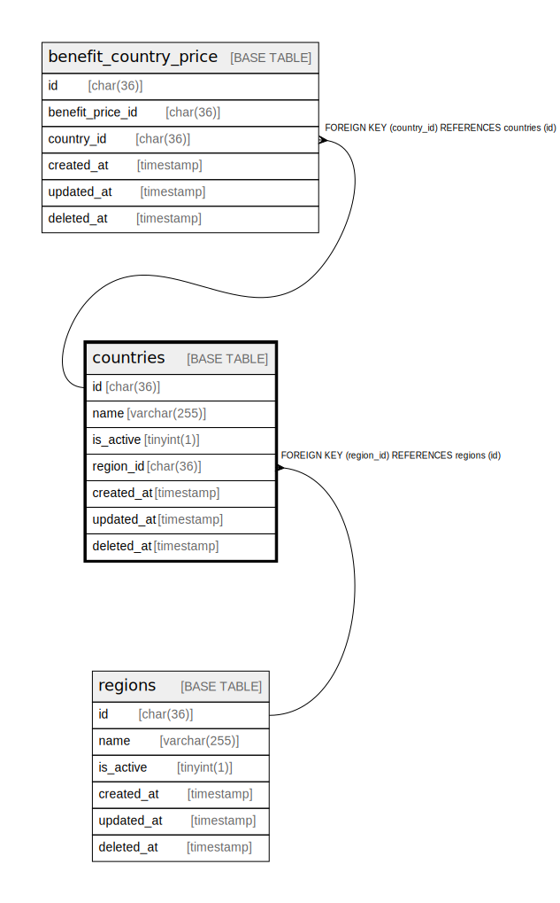

# countries

## Description

<details>
<summary><strong>Table Definition</strong></summary>

```sql
CREATE TABLE `countries` (
  `id` char(36) COLLATE utf8mb4_unicode_ci NOT NULL,
  `name` varchar(255) COLLATE utf8mb4_unicode_ci NOT NULL,
  `is_active` tinyint(1) NOT NULL DEFAULT '1',
  `region_id` char(36) COLLATE utf8mb4_unicode_ci DEFAULT NULL,
  `created_at` timestamp NULL DEFAULT NULL,
  `updated_at` timestamp NULL DEFAULT NULL,
  `deleted_at` timestamp NULL DEFAULT NULL,
  PRIMARY KEY (`id`),
  UNIQUE KEY `countries_name_unique` (`name`),
  KEY `countries_region_id_foreign` (`region_id`),
  CONSTRAINT `countries_region_id_foreign` FOREIGN KEY (`region_id`) REFERENCES `regions` (`id`) ON DELETE SET NULL
) ENGINE=InnoDB DEFAULT CHARSET=utf8mb4 COLLATE=utf8mb4_unicode_ci
```

</details>

## Columns

| Name | Type | Default | Nullable | Children | Parents | Comment |
| ---- | ---- | ------- | -------- | -------- | ------- | ------- |
| id | char(36) |  | false | [benefit_country_price](benefit_country_price.md) |  |  |
| name | varchar(255) |  | false |  |  |  |
| is_active | tinyint(1) | 1 | false |  |  |  |
| region_id | char(36) |  | true |  | [regions](regions.md) |  |
| created_at | timestamp |  | true |  |  |  |
| updated_at | timestamp |  | true |  |  |  |
| deleted_at | timestamp |  | true |  |  |  |

## Constraints

| Name | Type | Definition |
| ---- | ---- | ---------- |
| countries_name_unique | UNIQUE | UNIQUE KEY countries_name_unique (name) |
| countries_region_id_foreign | FOREIGN KEY | FOREIGN KEY (region_id) REFERENCES regions (id) |
| PRIMARY | PRIMARY KEY | PRIMARY KEY (id) |

## Indexes

| Name | Definition |
| ---- | ---------- |
| countries_region_id_foreign | KEY countries_region_id_foreign (region_id) USING BTREE |
| PRIMARY | PRIMARY KEY (id) USING BTREE |
| countries_name_unique | UNIQUE KEY countries_name_unique (name) USING BTREE |

## Relations



---

> Generated by [tbls](https://github.com/k1LoW/tbls)
