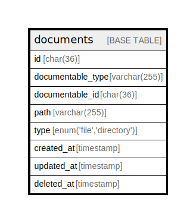

# documents

## Description

<details>
<summary><strong>Table Definition</strong></summary>

```sql
CREATE TABLE `documents` (
  `id` char(36) COLLATE utf8mb4_unicode_ci NOT NULL,
  `documentable_type` varchar(255) COLLATE utf8mb4_unicode_ci NOT NULL,
  `documentable_id` char(36) COLLATE utf8mb4_unicode_ci NOT NULL,
  `path` varchar(255) COLLATE utf8mb4_unicode_ci NOT NULL,
  `type` enum('file','directory') COLLATE utf8mb4_unicode_ci NOT NULL,
  `created_at` timestamp NULL DEFAULT NULL,
  `updated_at` timestamp NULL DEFAULT NULL,
  `deleted_at` timestamp NULL DEFAULT NULL,
  UNIQUE KEY `documents_path_unique` (`path`),
  KEY `documents_documentable_type_documentable_id_index` (`documentable_type`,`documentable_id`)
) ENGINE=InnoDB DEFAULT CHARSET=utf8mb4 COLLATE=utf8mb4_unicode_ci
```

</details>

## Columns

| Name | Type | Default | Nullable | Children | Parents | Comment |
| ---- | ---- | ------- | -------- | -------- | ------- | ------- |
| id | char(36) |  | false |  |  |  |
| documentable_type | varchar(255) |  | false |  |  |  |
| documentable_id | char(36) |  | false |  |  |  |
| path | varchar(255) |  | false |  |  |  |
| type | enum('file','directory') |  | false |  |  |  |
| created_at | timestamp |  | true |  |  |  |
| updated_at | timestamp |  | true |  |  |  |
| deleted_at | timestamp |  | true |  |  |  |

## Constraints

| Name | Type | Definition |
| ---- | ---- | ---------- |
| documents_path_unique | UNIQUE | UNIQUE KEY documents_path_unique (path) |

## Indexes

| Name | Definition |
| ---- | ---------- |
| documents_documentable_type_documentable_id_index | KEY documents_documentable_type_documentable_id_index (documentable_type, documentable_id) USING BTREE |
| documents_path_unique | UNIQUE KEY documents_path_unique (path) USING BTREE |

## Relations



---

> Generated by [tbls](https://github.com/k1LoW/tbls)
