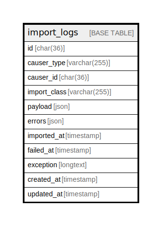

# import_logs

## Description

<details>
<summary><strong>Table Definition</strong></summary>

```sql
CREATE TABLE `import_logs` (
  `id` char(36) COLLATE utf8mb4_unicode_ci NOT NULL,
  `causer_type` varchar(255) COLLATE utf8mb4_unicode_ci DEFAULT NULL,
  `causer_id` char(36) COLLATE utf8mb4_unicode_ci DEFAULT NULL,
  `import_class` varchar(255) COLLATE utf8mb4_unicode_ci NOT NULL,
  `payload` json NOT NULL,
  `errors` json DEFAULT NULL,
  `imported_at` timestamp NULL DEFAULT NULL,
  `failed_at` timestamp NULL DEFAULT NULL,
  `exception` longtext COLLATE utf8mb4_unicode_ci,
  `created_at` timestamp NULL DEFAULT NULL,
  `updated_at` timestamp NULL DEFAULT NULL,
  PRIMARY KEY (`id`),
  KEY `import_logs_causer_type_causer_id_index` (`causer_type`,`causer_id`)
) ENGINE=InnoDB DEFAULT CHARSET=utf8mb4 COLLATE=utf8mb4_unicode_ci
```

</details>

## Columns

| Name | Type | Default | Nullable | Children | Parents | Comment |
| ---- | ---- | ------- | -------- | -------- | ------- | ------- |
| id | char(36) |  | false |  |  |  |
| causer_type | varchar(255) |  | true |  |  |  |
| causer_id | char(36) |  | true |  |  |  |
| import_class | varchar(255) |  | false |  |  |  |
| payload | json |  | false |  |  |  |
| errors | json |  | true |  |  |  |
| imported_at | timestamp |  | true |  |  |  |
| failed_at | timestamp |  | true |  |  |  |
| exception | longtext |  | true |  |  |  |
| created_at | timestamp |  | true |  |  |  |
| updated_at | timestamp |  | true |  |  |  |

## Constraints

| Name | Type | Definition |
| ---- | ---- | ---------- |
| PRIMARY | PRIMARY KEY | PRIMARY KEY (id) |

## Indexes

| Name | Definition |
| ---- | ---------- |
| import_logs_causer_type_causer_id_index | KEY import_logs_causer_type_causer_id_index (causer_type, causer_id) USING BTREE |
| PRIMARY | PRIMARY KEY (id) USING BTREE |

## Relations



---

> Generated by [tbls](https://github.com/k1LoW/tbls)
