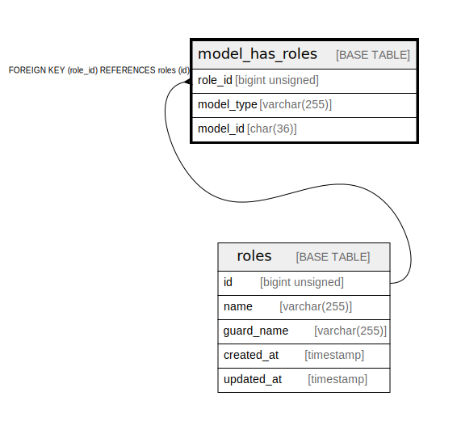

# model_has_roles

## Description

<details>
<summary><strong>Table Definition</strong></summary>

```sql
CREATE TABLE `model_has_roles` (
  `role_id` bigint unsigned NOT NULL,
  `model_type` varchar(255) COLLATE utf8mb4_unicode_ci NOT NULL,
  `model_id` char(36) COLLATE utf8mb4_unicode_ci NOT NULL,
  PRIMARY KEY (`role_id`,`model_id`,`model_type`),
  KEY `model_has_roles_model_id_model_type_index` (`model_id`,`model_type`),
  CONSTRAINT `model_has_roles_role_id_foreign` FOREIGN KEY (`role_id`) REFERENCES `roles` (`id`) ON DELETE CASCADE
) ENGINE=InnoDB DEFAULT CHARSET=utf8mb4 COLLATE=utf8mb4_unicode_ci
```

</details>

## Columns

| Name | Type | Default | Nullable | Children | Parents | Comment |
| ---- | ---- | ------- | -------- | -------- | ------- | ------- |
| role_id | bigint unsigned |  | false |  | [roles](roles.md) |  |
| model_type | varchar(255) |  | false |  |  |  |
| model_id | char(36) |  | false |  |  |  |

## Constraints

| Name | Type | Definition |
| ---- | ---- | ---------- |
| model_has_roles_role_id_foreign | FOREIGN KEY | FOREIGN KEY (role_id) REFERENCES roles (id) |
| PRIMARY | PRIMARY KEY | PRIMARY KEY (role_id, model_id, model_type) |

## Indexes

| Name | Definition |
| ---- | ---------- |
| model_has_roles_model_id_model_type_index | KEY model_has_roles_model_id_model_type_index (model_id, model_type) USING BTREE |
| PRIMARY | PRIMARY KEY (role_id, model_id, model_type) USING BTREE |

## Relations



---

> Generated by [tbls](https://github.com/k1LoW/tbls)
