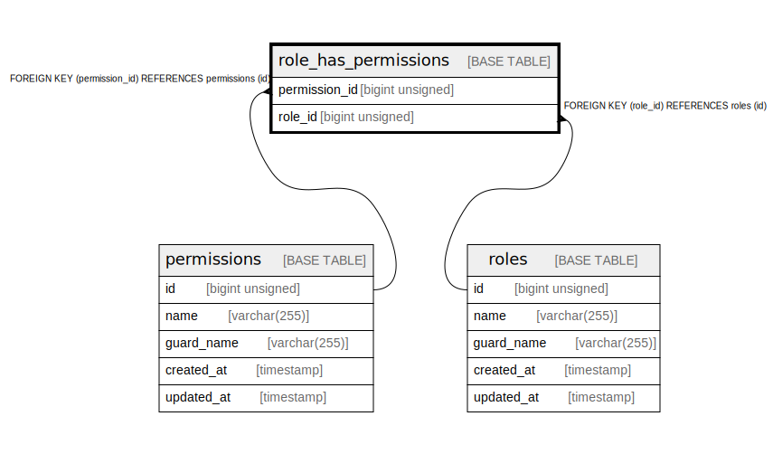

# role_has_permissions

## Description

<details>
<summary><strong>Table Definition</strong></summary>

```sql
CREATE TABLE `role_has_permissions` (
  `permission_id` bigint unsigned NOT NULL,
  `role_id` bigint unsigned NOT NULL,
  PRIMARY KEY (`permission_id`,`role_id`),
  KEY `role_has_permissions_role_id_foreign` (`role_id`),
  CONSTRAINT `role_has_permissions_permission_id_foreign` FOREIGN KEY (`permission_id`) REFERENCES `permissions` (`id`) ON DELETE CASCADE,
  CONSTRAINT `role_has_permissions_role_id_foreign` FOREIGN KEY (`role_id`) REFERENCES `roles` (`id`) ON DELETE CASCADE
) ENGINE=InnoDB DEFAULT CHARSET=utf8mb4 COLLATE=utf8mb4_unicode_ci
```

</details>

## Columns

| Name | Type | Default | Nullable | Children | Parents | Comment |
| ---- | ---- | ------- | -------- | -------- | ------- | ------- |
| permission_id | bigint unsigned |  | false |  | [permissions](permissions.md) |  |
| role_id | bigint unsigned |  | false |  | [roles](roles.md) |  |

## Constraints

| Name | Type | Definition |
| ---- | ---- | ---------- |
| PRIMARY | PRIMARY KEY | PRIMARY KEY (permission_id, role_id) |
| role_has_permissions_permission_id_foreign | FOREIGN KEY | FOREIGN KEY (permission_id) REFERENCES permissions (id) |
| role_has_permissions_role_id_foreign | FOREIGN KEY | FOREIGN KEY (role_id) REFERENCES roles (id) |

## Indexes

| Name | Definition |
| ---- | ---------- |
| role_has_permissions_role_id_foreign | KEY role_has_permissions_role_id_foreign (role_id) USING BTREE |
| PRIMARY | PRIMARY KEY (permission_id, role_id) USING BTREE |

## Relations



---

> Generated by [tbls](https://github.com/k1LoW/tbls)
