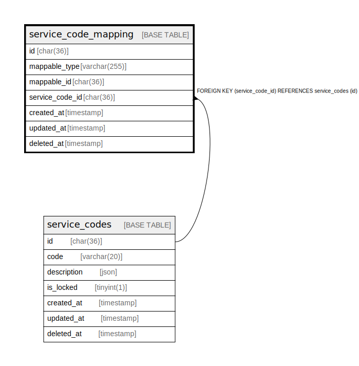

# service_code_mapping

## Description

<details>
<summary><strong>Table Definition</strong></summary>

```sql
CREATE TABLE `service_code_mapping` (
  `id` char(36) COLLATE utf8mb4_unicode_ci NOT NULL,
  `mappable_type` varchar(255) COLLATE utf8mb4_unicode_ci NOT NULL,
  `mappable_id` char(36) COLLATE utf8mb4_unicode_ci NOT NULL,
  `service_code_id` char(36) COLLATE utf8mb4_unicode_ci NOT NULL,
  `created_at` timestamp NULL DEFAULT NULL,
  `updated_at` timestamp NULL DEFAULT NULL,
  `deleted_at` timestamp NULL DEFAULT NULL,
  PRIMARY KEY (`id`),
  KEY `service_code_mapping_service_code_id_foreign` (`service_code_id`),
  KEY `service_code_mapping_index` (`mappable_type`,`mappable_id`,`service_code_id`),
  CONSTRAINT `service_code_mapping_service_code_id_foreign` FOREIGN KEY (`service_code_id`) REFERENCES `service_codes` (`id`) ON DELETE CASCADE
) ENGINE=InnoDB DEFAULT CHARSET=utf8mb4 COLLATE=utf8mb4_unicode_ci
```

</details>

## Columns

| Name | Type | Default | Nullable | Children | Parents | Comment |
| ---- | ---- | ------- | -------- | -------- | ------- | ------- |
| id | char(36) |  | false |  |  |  |
| mappable_type | varchar(255) |  | false |  |  |  |
| mappable_id | char(36) |  | false |  |  |  |
| service_code_id | char(36) |  | false |  | [service_codes](service_codes.md) |  |
| created_at | timestamp |  | true |  |  |  |
| updated_at | timestamp |  | true |  |  |  |
| deleted_at | timestamp |  | true |  |  |  |

## Constraints

| Name | Type | Definition |
| ---- | ---- | ---------- |
| PRIMARY | PRIMARY KEY | PRIMARY KEY (id) |
| service_code_mapping_service_code_id_foreign | FOREIGN KEY | FOREIGN KEY (service_code_id) REFERENCES service_codes (id) |

## Indexes

| Name | Definition |
| ---- | ---------- |
| service_code_mapping_index | KEY service_code_mapping_index (mappable_type, mappable_id, service_code_id) USING BTREE |
| service_code_mapping_service_code_id_foreign | KEY service_code_mapping_service_code_id_foreign (service_code_id) USING BTREE |
| PRIMARY | PRIMARY KEY (id) USING BTREE |

## Relations



---

> Generated by [tbls](https://github.com/k1LoW/tbls)
