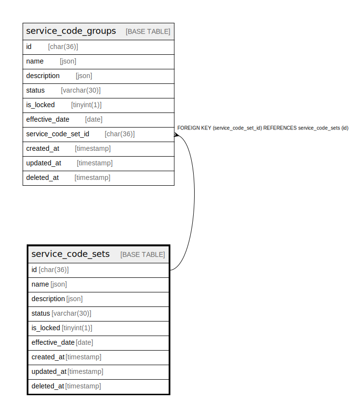

# service_code_sets

## Description

<details>
<summary><strong>Table Definition</strong></summary>

```sql
CREATE TABLE `service_code_sets` (
  `id` char(36) COLLATE utf8mb4_unicode_ci NOT NULL,
  `name` json NOT NULL,
  `description` json DEFAULT NULL,
  `status` varchar(30) COLLATE utf8mb4_unicode_ci NOT NULL DEFAULT 'active',
  `is_locked` tinyint(1) NOT NULL DEFAULT '0',
  `effective_date` date DEFAULT NULL,
  `created_at` timestamp NULL DEFAULT NULL,
  `updated_at` timestamp NULL DEFAULT NULL,
  `deleted_at` timestamp NULL DEFAULT NULL,
  PRIMARY KEY (`id`)
) ENGINE=InnoDB DEFAULT CHARSET=utf8mb4 COLLATE=utf8mb4_unicode_ci
```

</details>

## Columns

| Name | Type | Default | Nullable | Children | Parents | Comment |
| ---- | ---- | ------- | -------- | -------- | ------- | ------- |
| id | char(36) |  | false | [service_code_groups](service_code_groups.md) |  |  |
| name | json |  | false |  |  |  |
| description | json |  | true |  |  |  |
| status | varchar(30) | active | false |  |  |  |
| is_locked | tinyint(1) | 0 | false |  |  |  |
| effective_date | date |  | true |  |  |  |
| created_at | timestamp |  | true |  |  |  |
| updated_at | timestamp |  | true |  |  |  |
| deleted_at | timestamp |  | true |  |  |  |

## Constraints

| Name | Type | Definition |
| ---- | ---- | ---------- |
| PRIMARY | PRIMARY KEY | PRIMARY KEY (id) |

## Indexes

| Name | Definition |
| ---- | ---------- |
| PRIMARY | PRIMARY KEY (id) USING BTREE |

## Relations



---

> Generated by [tbls](https://github.com/k1LoW/tbls)
