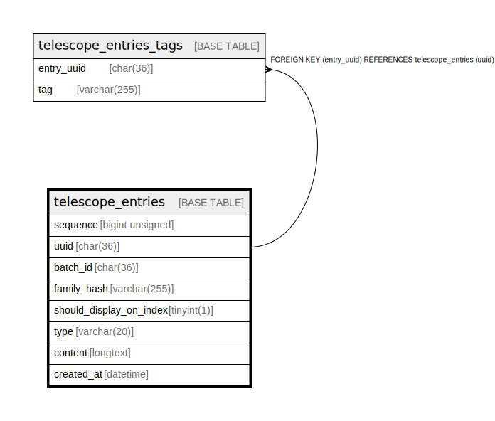

# telescope_entries

## Description

<details>
<summary><strong>Table Definition</strong></summary>

```sql
CREATE TABLE `telescope_entries` (
  `sequence` bigint unsigned NOT NULL AUTO_INCREMENT,
  `uuid` char(36) COLLATE utf8mb4_unicode_ci NOT NULL,
  `batch_id` char(36) COLLATE utf8mb4_unicode_ci NOT NULL,
  `family_hash` varchar(255) COLLATE utf8mb4_unicode_ci DEFAULT NULL,
  `should_display_on_index` tinyint(1) NOT NULL DEFAULT '1',
  `type` varchar(20) COLLATE utf8mb4_unicode_ci NOT NULL,
  `content` longtext COLLATE utf8mb4_unicode_ci NOT NULL,
  `created_at` datetime DEFAULT NULL,
  PRIMARY KEY (`sequence`),
  UNIQUE KEY `telescope_entries_uuid_unique` (`uuid`),
  KEY `telescope_entries_batch_id_index` (`batch_id`),
  KEY `telescope_entries_family_hash_index` (`family_hash`),
  KEY `telescope_entries_created_at_index` (`created_at`),
  KEY `telescope_entries_type_should_display_on_index_index` (`type`,`should_display_on_index`)
) ENGINE=InnoDB AUTO_INCREMENT=[Redacted by tbls] DEFAULT CHARSET=utf8mb4 COLLATE=utf8mb4_unicode_ci
```

</details>

## Columns

| Name | Type | Default | Nullable | Extra Definition | Children | Parents | Comment |
| ---- | ---- | ------- | -------- | ---------------- | -------- | ------- | ------- |
| sequence | bigint unsigned |  | false | auto_increment |  |  |  |
| uuid | char(36) |  | false |  | [telescope_entries_tags](telescope_entries_tags.md) |  |  |
| batch_id | char(36) |  | false |  |  |  |  |
| family_hash | varchar(255) |  | true |  |  |  |  |
| should_display_on_index | tinyint(1) | 1 | false |  |  |  |  |
| type | varchar(20) |  | false |  |  |  |  |
| content | longtext |  | false |  |  |  |  |
| created_at | datetime |  | true |  |  |  |  |

## Constraints

| Name | Type | Definition |
| ---- | ---- | ---------- |
| PRIMARY | PRIMARY KEY | PRIMARY KEY (sequence) |
| telescope_entries_uuid_unique | UNIQUE | UNIQUE KEY telescope_entries_uuid_unique (uuid) |

## Indexes

| Name | Definition |
| ---- | ---------- |
| telescope_entries_batch_id_index | KEY telescope_entries_batch_id_index (batch_id) USING BTREE |
| telescope_entries_created_at_index | KEY telescope_entries_created_at_index (created_at) USING BTREE |
| telescope_entries_family_hash_index | KEY telescope_entries_family_hash_index (family_hash) USING BTREE |
| telescope_entries_type_should_display_on_index_index | KEY telescope_entries_type_should_display_on_index_index (type, should_display_on_index) USING BTREE |
| PRIMARY | PRIMARY KEY (sequence) USING BTREE |
| telescope_entries_uuid_unique | UNIQUE KEY telescope_entries_uuid_unique (uuid) USING BTREE |

## Relations



---

> Generated by [tbls](https://github.com/k1LoW/tbls)
