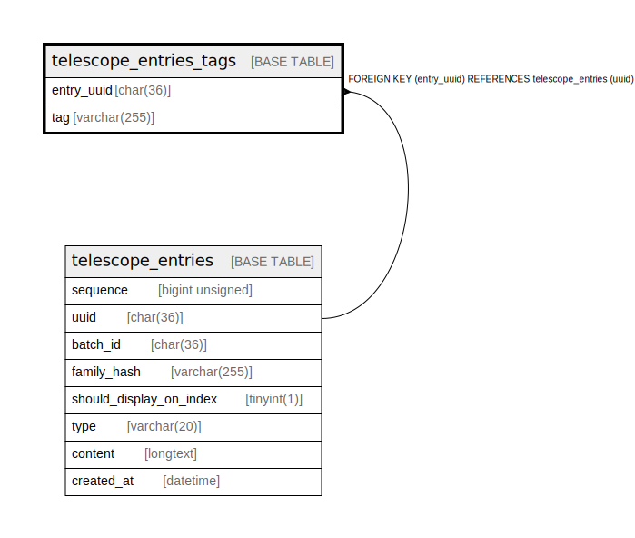

# telescope_entries_tags

## Description

<details>
<summary><strong>Table Definition</strong></summary>

```sql
CREATE TABLE `telescope_entries_tags` (
  `entry_uuid` char(36) COLLATE utf8mb4_unicode_ci NOT NULL,
  `tag` varchar(255) COLLATE utf8mb4_unicode_ci NOT NULL,
  PRIMARY KEY (`entry_uuid`,`tag`),
  KEY `telescope_entries_tags_tag_index` (`tag`),
  CONSTRAINT `telescope_entries_tags_entry_uuid_foreign` FOREIGN KEY (`entry_uuid`) REFERENCES `telescope_entries` (`uuid`) ON DELETE CASCADE
) ENGINE=InnoDB DEFAULT CHARSET=utf8mb4 COLLATE=utf8mb4_unicode_ci
```

</details>

## Columns

| Name | Type | Default | Nullable | Children | Parents | Comment |
| ---- | ---- | ------- | -------- | -------- | ------- | ------- |
| entry_uuid | char(36) |  | false |  | [telescope_entries](telescope_entries.md) |  |
| tag | varchar(255) |  | false |  |  |  |

## Constraints

| Name | Type | Definition |
| ---- | ---- | ---------- |
| PRIMARY | PRIMARY KEY | PRIMARY KEY (entry_uuid, tag) |
| telescope_entries_tags_entry_uuid_foreign | FOREIGN KEY | FOREIGN KEY (entry_uuid) REFERENCES telescope_entries (uuid) |

## Indexes

| Name | Definition |
| ---- | ---------- |
| telescope_entries_tags_tag_index | KEY telescope_entries_tags_tag_index (tag) USING BTREE |
| PRIMARY | PRIMARY KEY (entry_uuid, tag) USING BTREE |

## Relations



---

> Generated by [tbls](https://github.com/k1LoW/tbls)
