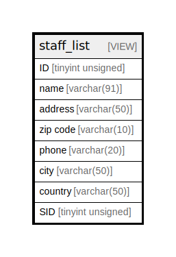

# staff_list

## Description

VIEW

<details>
<summary><strong>Table Definition</strong></summary>

```sql
CREATE VIEW staff_list AS (select `s`.`staff_id` AS `ID`,concat(`s`.`first_name`,' ',`s`.`last_name`) AS `name`,`a`.`address` AS `address`,`a`.`postal_code` AS `zip code`,`a`.`phone` AS `phone`,`sakila_db`.`city`.`city` AS `city`,`sakila_db`.`country`.`country` AS `country`,`s`.`store_id` AS `SID` from (((`sakila_db`.`staff` `s` join `sakila_db`.`address` `a` on((`s`.`address_id` = `a`.`address_id`))) join `sakila_db`.`city` on((`a`.`city_id` = `sakila_db`.`city`.`city_id`))) join `sakila_db`.`country` on((`sakila_db`.`city`.`country_id` = `sakila_db`.`country`.`country_id`))))
```

</details>

## Referenced Tables

- [staff](staff.md)
- [address](address.md)
- [city](city.md)
- [country](country.md)

## Columns

| Name | Type | Default | Nullable | Children | Parents | Comment |
| ---- | ---- | ------- | -------- | -------- | ------- | ------- |
| ID | tinyint unsigned | 0 | false |  |  |  |
| name | varchar(91) |  | false |  |  |  |
| address | varchar(50) |  | false |  |  |  |
| zip code | varchar(10) |  | true |  |  |  |
| phone | varchar(20) |  | false |  |  |  |
| city | varchar(50) |  | false |  |  |  |
| country | varchar(50) |  | false |  |  |  |
| SID | tinyint unsigned |  | false |  |  |  |

## Relations



---

> Generated by [tbls](https://github.com/k1LoW/tbls)
